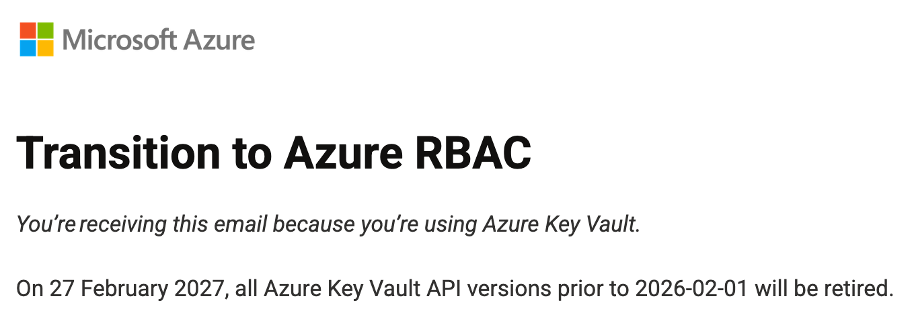

<div class="h-full flex flex-col items-center justify-center text-center gap-6">

# Don't lose the keys to your Azure Key Vaults


David Gardiner, Senior Developer, SixPivot

</div>

---

# Why this talk now?



- On 27th February 2027, all Azure Key Vault API versions prior to 2026-02-01 will be retired.
- Starting with API version 2026-02-01, RBAC is the default model for newly created vaults.
- You can use access policies with this API version only if you explicitly enable it
- Existing key vaults continue unchanged


Sources:
- https://learn.microsoft.com/en-us/azure/key-vault/general/rbac-access-policy
- https://learn.microsoft.com/en-us/azure/key-vault/general/rbac-migration

<!--
On 27 February 2027, all Azure Key Vault API versions prior to 2026-02-01 will be retired.

Azure Key Vault API version 2026-02-01—releasing in February 2026—introduces an important security update: Azure role-based access control (RBAC) will be the default access control model for all newly created vaults. Existing key vaults will continue using their current access control model. Azure portal behavior will remain unchanged.

If you’re using legacy access policies for new and existing vaults, we recommend migrating to Azure RBAC before transitioning to API version 2026-02-01. To learn why Azure RBAC is critical to security, read our blog.

If you want to continue using legacy access policies for new key vault creation after transitioning to API version 2026-02-01, you'll need to explicitly configure access policies as the access control model in your CLI, PowerShell, Rest API, ARM, Bicep, and Terraform templates. If you don’t take this action, all newly created vaults will be created with Azure RBAC as the default access control model, which can result in HTTP 403 errors and failures in your code and operations due to missing roles.
Required action

Migrate new and existing vaults to Azure RBAC before transitioning to API version 2026-02-01 or explicitly configure new vaults to use legacy access policies.

You’ll need to transition to API version 2026-02-01 before 27 February 2027, when all prior APIs will be retired.
-->

---

# Session objectives

By the end of this session, you should be able to:

- Explain what Azure Key Vault is and where it fits.
- Distinguish Standard vs Premium tiers.
- Compare access policies and Azure RBAC.
- Map common access-policy templates to RBAC roles.
- Execute migration through Portal, Bicep, and Terraform.

Source:
- https://learn.microsoft.com/en-us/azure/key-vault/general/overview

---

# What is Azure Key Vault

<div style="position:absolute; right:18px; top:90px; width:170px;">
  
  <p style="font-size:11px; line-height:1.2; margin-top:6px;">
    Photo by <a href="https://unsplash.com/@amoltyagi2">Amol Tyagi</a>
    on <a href="https://unsplash.com/photos/silver-skeleton-key-on-black-surface-0juktkOTkpU">Unsplash</a>
  </p>
</div>

Azure Key Vault is a managed service for:

- Secrets management (tokens, passwords, API keys)
- Key management (encryption keys)
- Certificate management (TLS/SSL certificates)

Source:
- https://learn.microsoft.com/en-us/azure/key-vault/general/overview

---

# Why teams use Key Vault

Key Vault helps teams:

- Centralize secrets instead of embedding them in code.
- Control access using Microsoft Entra authentication and authorization.
- Monitor access using diagnostics and logs.
- Integrate with other Azure services.

Sources:
- https://learn.microsoft.com/en-us/azure/key-vault/general/overview
- https://learn.microsoft.com/en-us/azure/key-vault/general/rbac-guide

---

# Demo

Azure Key Vaults

---

# Standard vs Premium tiers

Standard tier:

- Encrypts data using FIPS 140 validated software cryptographic modules.

Premium tier:

- Adds HSM-protected keys (for example RSA-HSM, EC-HSM, OCT-HSM).
- Uses FIPS 140-3 Level 3 validated HSMs for highest protection scenarios.

Source:
- https://learn.microsoft.com/en-us/azure/key-vault/general/overview
- https://learn.microsoft.com/en-us/azure/security/fundamentals/key-management
- https://csrc.nist.gov/pubs/fips/140-3/final

<!--
 FIPS 140-3 Security Requirements for Cryptographic Modules
 -->

---

# Core Key Vault security concepts

- Authentication is done through Microsoft Entra ID.
- Authorization can use RBAC or access policies.
- Vault data is encrypted at rest.
- Both control plane and data plane access must be designed deliberately.

Sources:
- https://learn.microsoft.com/en-us/azure/key-vault/general/overview
- https://learn.microsoft.com/en-us/azure/key-vault/general/rbac-guide

---

# Access models: RBAC vs access policies

<div style="position:absolute; right:18px; top:100px; width:170px;">
  
  <p style="font-size:11px; line-height:1.2; margin-top:6px;">
    Photo by <a href="https://unsplash.com/@flyd2069">FlyD</a>
    on <a href="https://unsplash.com/photos/red-padlock-on-black-computer-keyboard-mT7lXZPjk7U">Unsplash</a>
  </p>
</div>

Azure RBAC:

- Centralized Azure authorization model.
- Works with role assignments and scope (Key Vault or at secret, cert or key)
- Integrates with PIM and supports deny assignments.

Access policy model (legacy):

- Native Key Vault model for data plane access.
- Assigned at vault scope.

Sources:
- https://learn.microsoft.com/en-us/azure/key-vault/general/rbac-access-policy
- https://learn.microsoft.com/en-us/azure/key-vault/general/rbac-migration

---

# Can you keep access policies?

<div style="position:absolute; right:18px; bottom:24px; width:170px;">
  
  <p style="font-size:11px; line-height:1.2; margin-top:6px;">
    Photo by <a href="https://unsplash.com/@raphaelgb">Raphael GB</a>
    on <a href="https://unsplash.com/photos/a-key-on-a-door-dofnXBVZ51c">Unsplash</a>
  </p>
</div>

Short answer: yes, existing vaults can continue using access policies.

Strategic answer: migrate to RBAC because:

- It is the recommended model.
- It is the default for new vaults in current API behavior.
- It improves governance consistency across Azure.

Sources:
- https://learn.microsoft.com/en-us/azure/key-vault/general/rbac-access-policy
- https://learn.microsoft.com/en-us/azure/key-vault/general/rbac-migration

---

# Risk if you switch without planning

<div style="position:absolute; right:18px; top:100px; width:170px;">
  
  <p style="font-size:11px; line-height:1.2; margin-top:6px;">
    Photo by <a href="https://unsplash.com/@markusspiske">Markus Spiske</a>
    on <a href="https://unsplash.com/photos/black-and-gray-laptop-computer-turned-on-FXFz-sW0uwo">Unsplash</a>
  </p>
</div>

Important migration warning:

- Switching the permission model to RBAC invalidates all access policy permissions.
- Outages can occur if equivalent RBAC assignments are not created first.

Source:
- https://learn.microsoft.com/en-us/azure/key-vault/general/rbac-guide

---

# Control plane and data plane refresher

Control plane:

- Manage vault resource settings through Azure Resource Manager.

Data plane:

- Perform operations on keys, secrets, and certificates.

Design implication:

- Principals often need different permissions on each plane.

Source:
- https://learn.microsoft.com/en-us/azure/key-vault/general/rbac-guide

---

# Built-in Key Vault RBAC roles (data plane)

Common built-in roles include:

- Key Vault Administrator
- Key Vault Reader
- Key Vault Secrets Officer / Secrets User
- Key Vault Crypto Officer / Crypto User
- Key Vault Certificates Officer / Certificate User

Source:
- https://learn.microsoft.com/en-us/azure/key-vault/general/rbac-guide

---

# Access policy templates to RBAC mapping

Examples from Microsoft mapping guidance:

- Key, Secret, Certificate Management -> Key Vault Administrator
- Secret Management -> Key Vault Secrets Officer
- Key Management -> Key Vault Crypto Officer
- Certificate Management -> Key Vault Certificates Officer
- SQL Server Connector -> Key Vault Crypto Service Encryption User

Source:
- https://learn.microsoft.com/en-us/azure/key-vault/general/rbac-migration
- https://learn.microsoft.com/en-us/azure/role-based-access-control/permissions/security#microsoftkeyvault

---

# Mapping caveat: custom role scenarios

Some templates can require custom roles, for example:

- Azure Data Lake Storage or Azure Storage template scenarios
- Azure Backup template scenarios
- Azure Information BYOK scenarios

Source:
- https://learn.microsoft.com/en-us/azure/key-vault/general/rbac-migration
- https://learn.microsoft.com/en-us/azure/role-based-access-control/built-in-roles/security#key-vault-administrator

---

# Assignment scope model changes

RBAC lets you assign roles at multiple scopes:

- Management group
- Subscription
- Resource group
- Key Vault resource
- Individual key/secret/certificate

Access policies are limited to vault-level assignment.

Source:
- https://learn.microsoft.com/en-us/azure/key-vault/general/rbac-migration

---

# PIM in Key Vault governance

Microsoft guidance highlights using Microsoft Entra Privileged Identity Management (PIM) for just-in-time privileged access,
especially for admin/operator access at broader scopes.

Why this matters:

- Reduces standing privilege.
- Supports auditability and time-bounded elevation.

Sources:
- https://learn.microsoft.com/en-us/azure/key-vault/general/rbac-access-policy
- https://learn.microsoft.com/en-us/azure/key-vault/general/rbac-migration

---

# Migration strategy at a glance

Recommended sequence:

1. Prepare permissions and inventory identities.
2. Document current access policies.
3. Create equivalent RBAC assignments.
4. Enable RBAC mode on the vault.
5. Validate workload access.
6. Monitor and alert for issues.

Source:
- https://learn.microsoft.com/en-us/azure/key-vault/general/rbac-migration

---

# Prerequisites before migration

Required permissions include:

- Microsoft.Authorization/roleAssignments/write
- Microsoft.KeyVault/vaults/write

Classic subscription administrator roles are not supported for this migration flow.

Source:
- https://learn.microsoft.com/en-us/azure/key-vault/general/rbac-migration

---

# Portal migration workflow

Portal flow summary:

1. Capture current access policies.
2. Add equivalent IAM role assignments.
3. Change vault permission model to RBAC.
4. Validate secret/key/certificate operations.
5. Configure monitoring and diagnostics.

Source:
- https://learn.microsoft.com/en-us/azure/key-vault/general/rbac-migration

---

# Infrastructure as Code: Bicep step 1

Create RBAC role assignments first while vault is still on access policies.

```bicep {*}{maxHeight:'300px'}
param keyVaultName string
param principalId string

resource kv 'Microsoft.KeyVault/vaults@2023-07-01' existing = {
  name: keyVaultName
}

resource kvSecretsUser 'Microsoft.Authorization/roleAssignments@2022-04-01' = {
  name: guid(kv.id, principalId, '4633458b-17de-408a-b874-0445c86b69e6')
  scope: kv
  properties: {
    roleDefinitionId: subscriptionResourceId(
      'Microsoft.Authorization/roleDefinitions',
      '4633458b-17de-408a-b874-0445c86b69e6'
    )
    principalId: principalId
  }
}
```

Sources:
- https://learn.microsoft.com/en-us/azure/key-vault/general/rbac-migration
- https://learn.microsoft.com/en-us/azure/key-vault/general/rbac-guide

---

# Infrastructure as Code: Bicep step 2

After assignments are in place, switch the vault to RBAC permission model.

```bicep {*}{maxHeight:'300px'}
param location string = resourceGroup().location
param keyVaultName string
param tenantId string

resource kv 'Microsoft.KeyVault/vaults@2023-07-01' = {
  name: keyVaultName
  location: location
  properties: {
    tenantId: tenantId
    enableRbacAuthorization: true
    sku: {
      family: 'A'
      name: 'standard'
    }
  }
}
```

Sources:
- https://learn.microsoft.com/en-us/azure/key-vault/general/rbac-migration
- https://learn.microsoft.com/en-us/azure/key-vault/general/rbac-guide

---

# Demo: Bicep

---

# Infrastructure as Code: Terraform step 1

Create role assignments first at Key Vault scope.

```hcl {*}{maxHeight:'300px'}
resource "azurerm_key_vault" "kv" {
  name                       = var.key_vault_name
  location                   = var.location
  resource_group_name        = var.resource_group_name
  tenant_id                  = var.tenant_id
  sku_name                   = "standard"
  enable_rbac_authorization  = false
}

resource "azurerm_role_assignment" "kv_secrets_user" {
  scope                = azurerm_key_vault.kv.id
  role_definition_name = "Key Vault Secrets User"
  principal_id         = var.principal_id
}
```

Sources:
- https://learn.microsoft.com/en-us/azure/key-vault/general/rbac-migration
- https://learn.microsoft.com/en-us/azure/key-vault/general/rbac-guide

---

# Infrastructure as Code: Terraform step 2

After role assignments are applied, enable RBAC on the vault.

```hcl {*}{maxHeight:'300px'}
resource "azurerm_key_vault" "kv" {
  name                       = var.key_vault_name
  location                   = var.location
  resource_group_name        = var.resource_group_name
  tenant_id                  = var.tenant_id
  sku_name                   = "standard"
  enable_rbac_authorization  = true
}
```

Sources:
- https://learn.microsoft.com/en-us/azure/key-vault/general/rbac-migration
- https://learn.microsoft.com/en-us/azure/key-vault/general/rbac-guide

---

# Demo: Terraform

---

# Validation checklist after cutover

- Can each app list/read only what it needs?
- Can operators perform required key/cert/secret operations?
- Do denied actions fail as expected?
- Are role assignment propagation delays handled in runbooks/retries?

Source:
- https://learn.microsoft.com/en-us/azure/key-vault/general/rbac-migration

---

# Monitoring and diagnostics

<div style="position:absolute; right:18px; top:95px; width:170px;">
  
  <p style="font-size:11px; line-height:1.2; margin-top:6px;">
    Photo by <a href="https://unsplash.com/@hazelz">Hazel Z</a>
    on <a href="https://unsplash.com/photos/a-computer-screen-with-a-cloud-shaped-object-on-top-of-it-FocSgUZ10JM">Unsplash</a>
  </p>
</div>

After migration, configure diagnostics and monitor access issues.

Common destination options:

- Storage account
- Event Hub
- Azure Monitor Logs / Log Analytics

Source:
- https://learn.microsoft.com/en-us/azure/key-vault/general/overview
- https://learn.microsoft.com/en-us/azure/key-vault/general/rbac-migration

---

# Soft-delete and purge protection in operations

<div style="position:absolute; right:18px; top:95px; width:170px;">
  
  <p style="font-size:11px; line-height:1.2; margin-top:6px;">
    Photo by <a href="https://unsplash.com/@sarahspcreates">Sarah Penney</a>
    on <a href="https://unsplash.com/photos/a-gold-key-on-a-black-surface-5dVg9ae7hKk">Unsplash</a>
  </p>
</div>

Operational facts:

- Soft-delete is on by default for new vaults and cannot be disabled once enabled.
- Retention is configurable at creation (7-90 days, default 90).
- Purge protection is recommended in many encryption scenarios.

Sources:
- https://learn.microsoft.com/en-us/azure/key-vault/general/soft-delete-overview
- https://learn.microsoft.com/en-us/azure/key-vault/general/overview

<!--
Soft delete is designed to prevent accidental deletion of your key vault and keys, secrets, and certificates stored inside key vault. Think of soft-delete like a recycle bin.

Purge protection is designed to prevent the deletion of your key vault, keys, secrets, and certificates by a malicious insider. Think of it as a recycle bin with a time based lock.
-->

---

# Recovery caveat many teams miss

When a soft-deleted vault is recovered:

- Integrated services like RBAC role assignments are not restored automatically.
- You must recreate those assignments.

Source:
- https://learn.microsoft.com/en-us/azure/key-vault/general/soft-delete-overview

---

# Executive summary

- Key Vault remains foundational for secrets, keys, and certificates.
- RBAC is now the recommended model and default for new vaults.
- Migration is straightforward if identity mapping and validation are done first.
- PIM + scoped RBAC + diagnostics produce a stronger operating model.

Sources:
- https://learn.microsoft.com/en-us/azure/key-vault/general/overview
- https://learn.microsoft.com/en-us/azure/key-vault/general/rbac-access-policy
- https://learn.microsoft.com/en-us/azure/key-vault/general/rbac-migration

---

# Q&A

## Next actions for your team

- Inventory existing vaults and access policies this week.
- Build a mapping table to built-in/custom RBAC roles.
- Run one Bicep or Terraform pilot migration in dev.

<QRCode value="https://github.com/flcdrg/azure-keyvault-rbac" bottomAdjust="0px"  />
